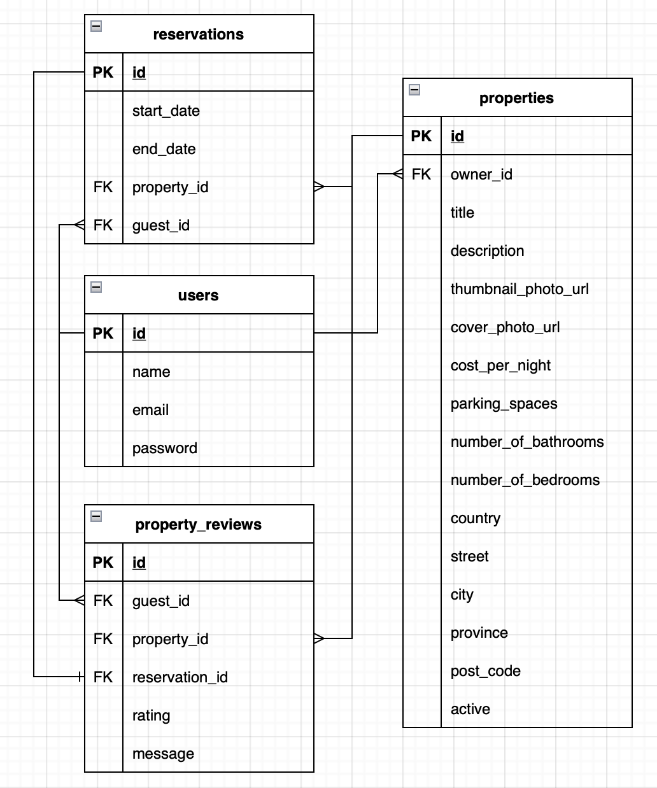
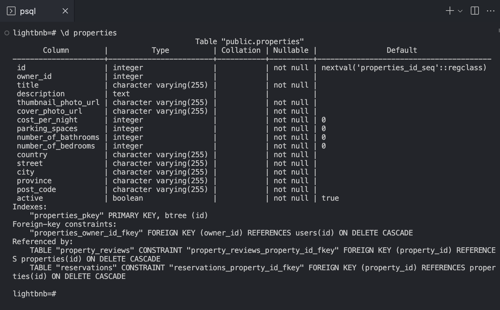
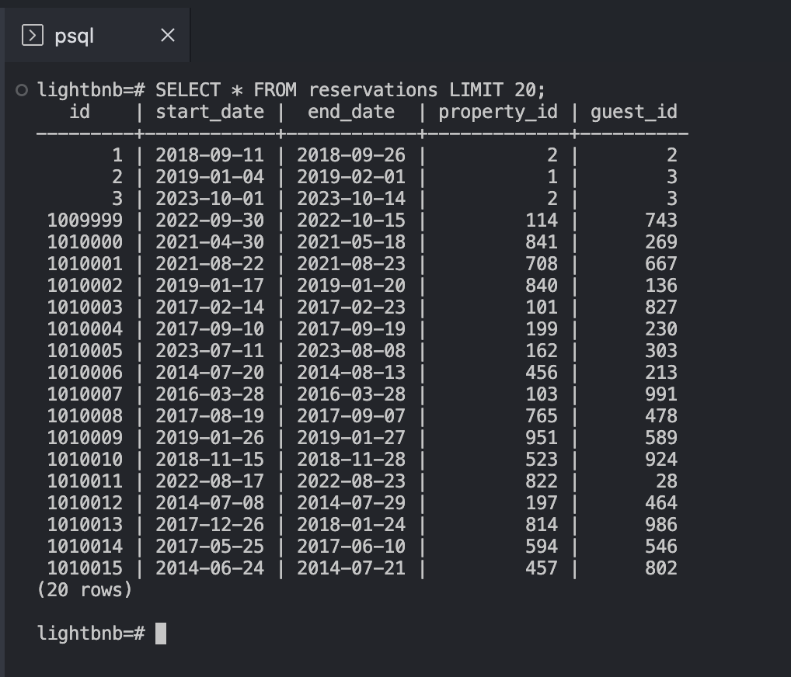

# LightBnB Project

LightBnB is a simple, multi-page AirBnB clone that uses server-side JavaScript to display information from queries to web pages via SQL queries.

## Purpose

To apply existing knowledge of complex SQL queries, database and ERD (entity relationship diagram) design to integrate the database with a Node backend.

## Gallery

|  | 
|:--:| 
| LightBnB ERD |

|  | 
|:--:| 
| Properties Table Schema |

|  | 
|:--:| 
| Reservations Table SQL Query |

## Getting Started

- Navigate to LightBnB_WebApp (using the `cd LightBnB_WebApp` command)
- Install all dependencies (using the `npm install` command)
- Run the development web server via `npm run local` command. The app will be served in localhost PORT: 3000
- Open your browser and navigate to <http://localhost:3000/>

## Dependencies

- pg
- Node 5.10.x or above
- express
- nodemon
- bcrypt
- body-parser
- cookie-session

## Footnote

This project was created and published by [Jerome Lagbas](https://github.com/jeromealmir) as part of the Web Development program at Lighthouse Labs.